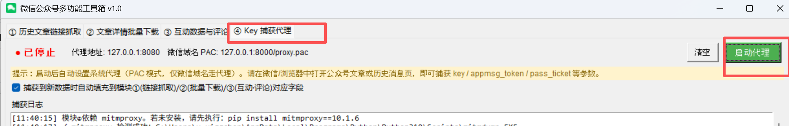
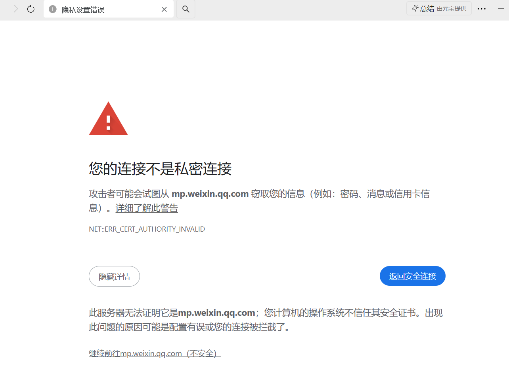
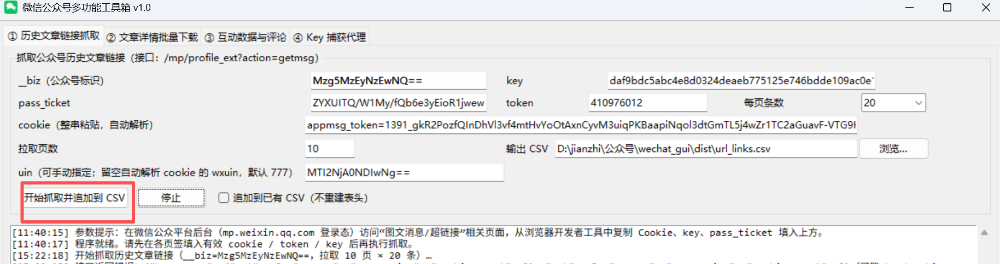
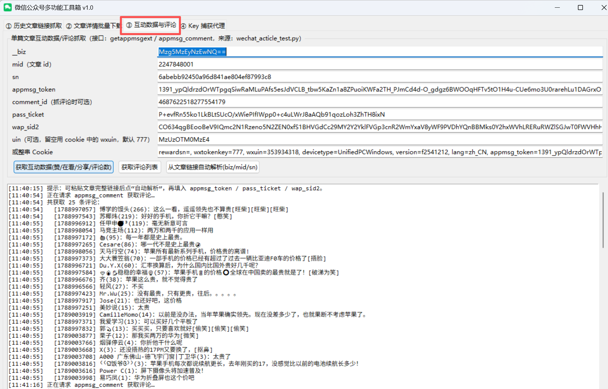

# WechatToolsBox

微信公众号内容采集与整理工具（Windows 桌面版，单文件绿色运行）。

本仓库仅发布编译后的可执行程序，不包含任何源代码。

## 功能

- 链接抓取：按公众号 / 关键词批量获取图文链接
- 历史文章：分页拉取指定公众号的历史发文列表
- 批量下载：按链接表批量下载图文内容并归档
- 抓包辅助：内置本地捕获代理，自动获取并回填请求凭据

## 使用

1. 下载 `WechatToolsBox.exe`
2. 双击运行，无需安装 Python 或其它依赖
3. 首次运行会在同级目录释放运行所需的附属文件，请勿单独移动 exe
4. 启动代理[img]
5. 在pc微信打开想要抓取的公众号的任意一遍文章，刷新一遍，即可获取到公众号信息(如果显示此页面，点击同意继续即可)
6. 公众号历史文章采集,文章链接会保存url_links.csv文件:
7. 评论和点赞采集, comment_id在爬取的文章html可找到:

## 运行环境

- Windows 10 / 11（64 位）
- 首次启动略慢属正常现象（单文件程序需自解压）

## 安全说明

程序内置请求侧防护，防止自身请求被第三方抓包工具截获：

## 免责声明

本工具仅供个人学习与技术研究使用。请遵守相关平台的服务条款及所在地法律法规，勿用于任何商业或非法用途。使用本工具产生的一切后果由使用者自行承担。
